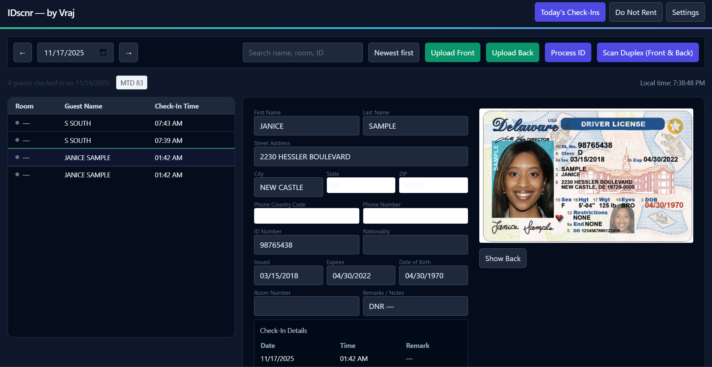
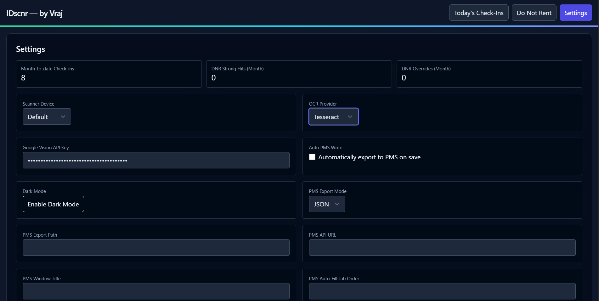

# ID_Scnr

Status: UNDER DEVELOPMENT

Privacy-first ID scanning and guest management system. The app scans ID front/back, extracts structured data locally, and manages guest check-ins with DNR (Do Not Rent) checks and exports for PMS systems.

## Overview
- Processes ID images from a physical scanner or manual upload.
- Extracts text with local OCR and parses barcode data when available.
- Creates a guest record with name, DOB, address, ID number, and more.
- Checks guests against a configurable DNR list and alerts on matches.
- Stores ID images encrypted at rest and keeps data local.
- Provides a modern UI for viewing, editing, and searching guest records.
- Exposes exports for PMS integration (JSON/CSV/API).

## How It Works
- Scanner Duplex:
  - Use a WIA-compatible scanner to capture front and back.
  - The app opens the scan dialogs sequentially, saves images, and continues processing.
- Upload Flow:
  - Upload front/back images if a scanner is unavailable.
  - Click Process to run local OCR and parse fields.
- Data Extraction:
  - OCR reads visible text; PDF417 barcode parsing is used when IDs include AAMVA data.
  - The system normalizes names, dates, and addresses into structured fields.
- Guest Management:
  - A guest record is created and displayed with images and extracted fields.
  - Edit fields as needed and save; history and search are available.
- DNR Check:
  - New guests are matched against the DNR list and flagged with details.
- Security:
  - Encrypted storage, local processing, and no external APIs for core features.
- Integrations:
  - Export guest data for PMS workflows; designed to support auto-fill.

## Key Functions
- Scan Duplex (Front & Back)
- Upload Front/Back and Process
- OCR + Barcode Parsing (AAMVA PDF417)
- Guest Record Creation & Editing
- DNR List Management & Matching
- Encrypted Image Storage
- Analytics & Daily Stats
- PMS Data Export (JSON/CSV/API)

## Typical Flow
1. Click “Scan Duplex” or upload front/back images.
2. Images are saved and encrypted locally.
3. OCR + barcode parsing extract text and identifiers.
4. The app parses fields and creates/updates a guest record.
5. DNR check runs; alerts shown if matched.
6. View, edit, search, and export as needed.

## Media
Screenshots and demo video:

<video src="media/demo.mp4" controls width="640"></video>

## Documentation
- Scanner setup and workflows: `docs/SCANNER_SETUP.md`
- OCR pipeline and improvements: `docs/OCR_IMPROVEMENTS.md`
- Portfolio/overview: `docs/PORTFOLIO.md`

## Notes
- Designed for local, privacy-focused operation.
- Uses WIA-compatible scanners on Windows; upload flow is available everywhere.
- DNR and PMS integration are configurable features intended for property management workflows.

