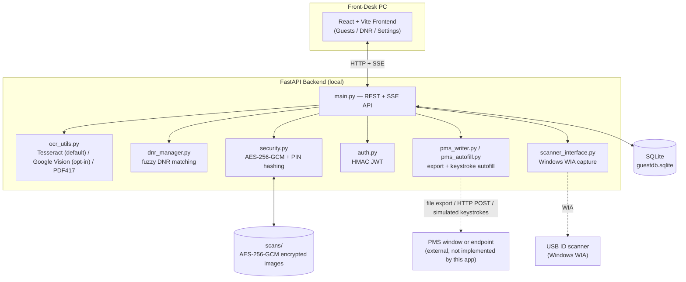

# IDscnr

A local-first ID scanning and guest check-in system for hotel/rental front desks: it OCRs a driver's license or passport, extracts structured guest data, checks it against a Do-Not-Rent list, stores the images encrypted at rest, and can hand the record off to a property management system.

**Built by:** [Vrajkumar Patel](https://github.com/vrajkumarpatel)

Demo video and screenshots: [`media/demo.mp4`](./media/demo.mp4), [`media/screenshot-1.png`](./media/screenshot-1.png), [`media/screenshot-2.png`](./media/screenshot-2.png)

---

## Problem

Front-desk ID check-in at hotels and short-term rentals is usually one of: manual data entry (slow, error-prone), or a cloud OCR/ID-verification SaaS (recurring cost, and guest PII — name, DOB, ID number, photo — leaves the building). Neither is a great fit for a small property that wants fast check-in without sending scanned government IDs to a third party by default.

## Solution

IDscnr runs entirely on a front-desk PC. It reads the ID's PDF417 barcode (AAMVA data) when present, falls back to Tesseract OCR on the image, normalizes the extracted fields, checks the guest against a local blacklist, and stores the ID images AES-256-GCM encrypted on disk. A Windows-only automation module can also scan directly from a USB ID scanner (WIA) and paste field values into an existing PMS window via simulated keystrokes.

---

## Features (verified against the code)

- **ID data extraction** — AAMVA PDF417 barcode parsing (`pyzbar`) with OCR fallback (Tesseract via `pytesseract`); tries multiple image-preprocessing variants and Tesseract PSM modes and keeps the highest-confidence result (`backend/ocr_utils.py`)
- **Optional cloud OCR** — a Google Cloud Vision provider is also implemented and selectable per-request (`extract_text_google` in `backend/ocr_utils.py`); it is **off by default** (Tesseract), only activates if you supply your own `GOOGLE_VISION_API_KEY` / API key in Settings, and is a real, currently-wired code path (not something removed, despite what `CHANGELOG.md` in this repo claims — see [Limitations](#limitations))
- **Structured field parsing** — name, DOB, ID number, address, issue/expiration dates, with format handling for AAMVA barcode fields, passport MRZ (TD3), and free-text OCR labels (`backend/docs/date-parsing.md`)
- **Guest check-in management** — CRUD over guest records with full history, search, and edit (`backend/main.py`, `frontend/src/pages/Guests.jsx`)
- **DNR (Do Not Rent) matching** — exact match on normalized ID number, otherwise fuzzy name matching (`difflib.SequenceMatcher`) against DOB-matched candidates with a tiered confidence score; PIN-protected override with an audit trail (`backend/dnr_manager.py`)
- **Encrypted image storage** — ID photos are encrypted with AES-256-GCM (`cryptography.hazmat` AESGCM) before being written to `scans/`; the key is generated locally into a gitignored file, never committed (`backend/security.py`)
- **Auth** — a hand-rolled HMAC-SHA256 JWT implementation (`backend/auth.py`) plus a separate admin PIN (SHA-256 hashed, no salt — see Limitations) for privileged actions; basic per-IP login rate limiting (20 attempts / 5 min, in-memory)
- **Physical scanner capture** — Windows WIA integration via `comtypes`, including a duplex flow (two sequential acquisitions for front/back) (`backend/utils/scanner_interface.py`) — **Windows only**
- **PMS export** — writes guest records to JSON or CSV files, or POSTs to a configurable HTTP endpoint (`backend/pms_writer.py`); a separate Windows-only autofill module simulates keystrokes (clipboard paste + Tab) to fill fields into another application's window (`backend/pms_autofill.py`) — this is desktop automation, not an integration with any specific PMS vendor's API
- **Real-time updates** — Server-Sent Events endpoint for live check-in notifications
- **Dark mode, responsive UI** — React 18 + Tailwind + Framer Motion

---

## Architecture


```mermaid
flowchart TB
    subgraph Client["Front-Desk PC"]
        UI["React + Vite Frontend<br/>(Guests / DNR / Settings)"]
    end

    subgraph Server["FastAPI Backend (local)"]
        API["main.py — REST + SSE API"]
        OCR["ocr_utils.py<br/>Tesseract (default) / Google Vision (opt-in) / PDF417"]
        DNR["dnr_manager.py<br/>fuzzy DNR matching"]
        SEC["security.py<br/>AES-256-GCM + PIN hashing"]
        AUTH["auth.py<br/>HMAC JWT"]
        PMS["pms_writer.py / pms_autofill.py<br/>export + keystroke autofill"]
        SCAN["scanner_interface.py<br/>Windows WIA capture"]
    end

    DB[(SQLite<br/>guestdb.sqlite)]
    ENC[("scans/<br/>AES-256-GCM encrypted images")]
    EXT["PMS window or endpoint<br/>(external, not implemented by this app)"]
    DEVICE["USB ID scanner<br/>(Windows WIA)"]

    UI <-->|HTTP + SSE| API
    API --> OCR
    API --> DNR
    API --> AUTH
    API --> SEC
    API --> PMS
    API --> SCAN
    SEC <--> ENC
    API <--> DB
    SCAN -. WIA .-> DEVICE
    PMS -.->|file export / HTTP POST / simulated keystrokes| EXT
```

There is no Electron desktop wrapper: the `electron/` directory in this repo is empty. A stray root-level `package-lock.json` (referencing `electron` as a devDependency, with no matching `package.json`) shows a desktop-wrapper was scaffolded at some point but never built out — it's excluded from this repo as dead weight. Today this is a two-process local web app: run the FastAPI backend and the Vite dev server (or a built frontend) on the same machine.

---

## Technology Stack

Verified from `backend/requirements.txt` and `frontend/package.json`.

**Backend**
- FastAPI 0.115, Uvicorn — REST API + SSE
- SQLAlchemy 2.0 — ORM over SQLite
- Pydantic 2.9 — request/response validation
- Pillow, `pytesseract`, `pyzbar`, `numpy` — image preprocessing, OCR, barcode decoding
- `cryptography` 43 — AES-256-GCM encryption
- `pywin32`, `comtypes` (Windows only) — WIA scanner capture, PMS window autofill

**Frontend**
- React 18 + Vite 5
- TailwindCSS 3, Framer Motion
- Axios
- Vitest + Testing Library (unit), Playwright (e2e)

**Database:** SQLite, file-based, no server process.

---

## Security

- **Images at rest**: encrypted with AES-256-GCM. The key is generated on first run into `backend/config/secret.key` (JSON, base64-encoded key + salt) — this file is gitignored and must never be committed; back it up separately, because losing it makes existing encrypted scans permanently unreadable.
- **Auth tokens**: a custom HMAC-SHA256 JWT implementation (not a vetted library like `python-jose`/`pyjwt`) — functional, but worth knowing if you're evaluating this for anything beyond a portfolio/demo.
- **Admin PIN**: SHA-256 hash with **no salt**, default PIN is `1234` until changed. Change it immediately in Settings; don't treat the default as production-safe.
- **JWT secret**: falls back to a hardcoded `"dev-secret-change-me"` if `JWT_SECRET` isn't set in the environment — set it explicitly for any real deployment.
- **Rate limiting**: a basic in-memory per-IP counter on the login endpoint (20 attempts / 5 minutes). In-memory means it resets on restart and doesn't share state across multiple worker processes.
- **Runtime secrets stay out of git**: `.env`, `backend/config/secret.key`, `backend/config/pin.json`, `backend/config/settings.json` (can hold a Google Vision key once set via the UI), and `backend/config/users.json` are all gitignored.

---

## Installation

### Prerequisites
- Python 3.11+, Node.js 18+
- [Tesseract OCR](https://github.com/UB-Mannheim/tesseract/wiki) installed and on `PATH`

### Backend

```bash
cd backend
python -m venv venv
# Windows:
venv\Scripts\activate
# macOS/Linux:
source venv/bin/activate

pip install -r requirements.txt

# from the project root
python -m uvicorn backend.main:app --reload --host 0.0.0.0 --port 8000
```

API docs at `http://localhost:8000/docs`.

### Frontend

```bash
cd frontend
npm install
npm run dev
```

App at `http://localhost:5173`.

`scripts/install.sh` / `scripts/install.ps1` automate the above for Linux/macOS and Windows respectively.

**Note on Docker:** `DEPLOYMENT_GUIDE.md` and `INSTALL.md` in this repo document a Docker Compose deployment path in detail, but **no `Dockerfile` or `docker-compose.yml` exists in this codebase** — those sections are aspirational, not implemented. Use the manual setup above.

**Windows-only features:** physical scanner capture (WIA) and PMS window autofill use `pywin32`/`comtypes` and only work on Windows. On macOS/Linux you can still use image upload for OCR.

---

## Environment Variables

See [`.env.example`](./.env.example) for the full list of variable names this app reads (values are placeholders — the real `.env` is never committed). Generate real secrets yourself, e.g. `openssl rand -hex 32` for `JWT_SECRET`.

---

## Local Development

Run the backend (`uvicorn`, port 8000) and frontend (`vite`, port 5173) in separate terminals as shown above. The frontend calls the backend via `frontend/src/api.js`; CORS origins are controlled by `CORS_ORIGINS` / `backend/config/settings.json`.

---

## Testing

Test files exist and are committed; running them (`pytest`, `vitest`, `playwright test`) was not part of this integration pass, so pass/fail status isn't claimed here — treat "tests exist" and "tests currently pass" as separate facts.

**Backend** (`backend/tests/`, pytest): `test_api.py`, `test_date_parsing.py`, `test_date_validation.py`, `test_perf_smoke.py`, `test_security_image.py`.

```bash
cd backend
python -m pytest tests/
```

**Frontend** (`frontend/src/__tests__/`, Vitest + Testing Library): API client, `Guests` page, PIN validation.

```bash
cd frontend
npm test
```

**End-to-end** (`frontend/tests/`, Playwright): guest flow, DNR flow, smoke test.

```bash
cd frontend
npx playwright test
```

---

## Limitations

- **Electron wrapper: not implemented.** `electron/` is an empty directory.
- **Docker: not implemented.** Extensively documented in `DEPLOYMENT_GUIDE.md`/`INSTALL.md`, but there's no `Dockerfile` or `docker-compose.yml` in the repo.
- **"Tesseract only, no cloud APIs" is not accurate.** `CHANGELOG.md` claims Google OCR was removed; the code says otherwise — `extract_text_google()` and a `google_api_key` setting are fully wired in `backend/main.py` / `backend/ocr_utils.py`. It's opt-in and off by default, but it exists.
- **"Production Ready" (from the old `PORTFOLIO.md`) is not something this pass verified.** No CI, no run of the existing test suites during this integration, a hardcoded JWT fallback secret, an unsalted PIN hash, and a default PIN of `1234` are all things you'd want to address before calling it that.
- **PMS "integration" is file export + keystroke automation**, not an API integration with any named PMS vendor.
- **Windows-only features** (scanner capture, PMS autofill) silently aren't available on macOS/Linux.
- **Single SQLite file, no migrations tooling** — schema changes are applied by re-running `init_db()`, not via Alembic or similar.

## Future Improvements

- Real automated test run + CI (GitHub Actions) so "tests exist" becomes "tests pass on every push"
- Replace the hand-rolled JWT with a maintained library; salt the PIN hash
- An actual Electron (or Tauri) desktop build, if a packaged app is still wanted
- A real Dockerfile/compose setup matching what the docs already describe
- Cross-platform scanner support (or a documented upload-only fallback path)

---

## Freelance Relevance

This project is representative of client work involving:
- **Document/ID processing pipelines** — barcode + OCR extraction with multi-pass preprocessing and confidence-based provider fallback (local Tesseract ↔ cloud Vision API)
- **Encrypted local data handling** — AES-256-GCM at-rest encryption for sensitive documents, with the encryption key and PII-bearing config kept out of source control by design
- **Desktop automation for legacy integrations** — Windows scanner capture (WIA) and keystroke-based autofill into third-party desktop software, a common ask when a client's existing PMS/vendor system has no API
- **Fuzzy-matching business logic** — tiered blacklist matching with confidence scoring rather than naive exact-match

---

## License

MIT — see [LICENSE](./LICENSE).
