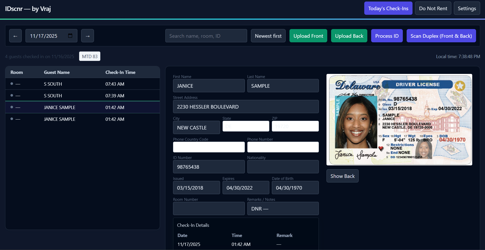
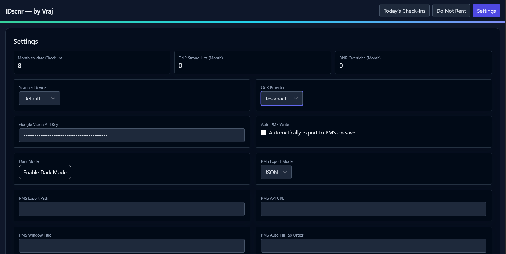

# ID_Scnr

Status: **planning stage — no application code committed yet**

A planned privacy-first ID scanning and guest management tool for hospitality/property use: scan a guest ID, extract fields locally via OCR, check against a Do-Not-Rent list, and export to a PMS. This repository currently holds the design notes, a demo of the intended UI, and screenshots — the actual FastAPI/React implementation described in those notes has not been built yet.

## What exists here

- `media/` — early UI mockup screenshots and a short demo video.
- `docs/SCANNER_SETUP.md` — planned scanner integration approach (WIA-compatible scanners).
- `docs/OCR_IMPROVEMENTS.md` — planned OCR pipeline notes (Tesseract configuration, preprocessing ideas).

## What doesn't exist yet

No source code — no FastAPI backend, no React frontend, no OCR pipeline, no DNR matching, no PMS export. The docs above describe an intended design, not a working system. Nothing here has been tested or run.

## Media

<video src="media/demo.mp4" controls width="640"></video>

## Next steps

If this project moves forward, the plan is to implement the backend (FastAPI + local Tesseract OCR + SQLite) and frontend (React) described in the docs, starting with the scan-and-extract flow.
